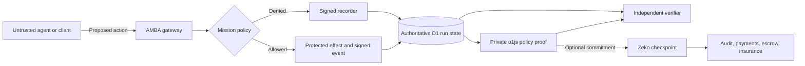

# Pirates at the Gate

> **Built on [Zeko Protocol](https://docs.zeko.io/) ([source](https://github.com/zeko-labs/zeko)).** Zeko is a ZK-rollup application layer for private, verifiable zkApps with Ethereum settlement. In this architecture, it is the verification and settlement layer for the agentic internet: agents can prove policy compliance over private data, publish shared commitments, and connect those proofs to machine-native payments, escrow, reputation, insurance, and penalties.

Pirates at the Gate is a working proof of a ready-to-run agent security protocol built around [Agent Mission-Bound Authorization (AMBA)](https://github.com/zeko-labs/agent-mission-bound-auth): a capability gateway, fail-closed signed flight recorder, independent verifier, real zero-knowledge policy proof, and optional Zeko checkpoint in one package. This POC implements AMBA's core enforcement pattern by binding each run to an allowed action, resource scope, dispatch budget, replay policy, and checkpoint. Put it between an untrusted agent and the systems it can affect; consequences happen only after an external policy check.

This directly addresses [the motivating article's central problem](https://blog.diogomonica.com/2026/09/28/ai-escapes-super-intelligence-or-super-incompetence/): containment and trustworthy evidence cannot depend on the same agent being contained. The demo uses a browser as the untrusted client and a synthetic package registry as the protected service, so it is safe to run and easy to inspect.

## What blockchain is for

Blockchain has three useful jobs here:

1. Publish a proof commitment outside the operator's database, so the committed history cannot be quietly replaced later.
2. Give auditors, insurers, counterparties, and dispute systems a common state to verify.
3. Connect verified behavior to an economic layer: payment, escrow, bonds, reputation, insurance, or penalties.

It is not the sandbox, permission gate, monitor, or kill switch. Those controls must act before the side effect. Pirates at the Gate works without a chain; optional Zeko publication makes the resulting proof commitment public and composable. Zeko fits naturally because the policy proof and checkpoint contract are written with o1js. No live zkApp address or funded wallet is required for this release.

## Why the protocol layer matters

A prompt is interpreted by the same system proposing the action. AMBA moves authorization to a boundary the agent does not control. It issues a scoped mission, authenticates the run, checks the operation and resource, rejects replay and budget violations, and records the decision with the synthetic service effect. If the recorder is unavailable, dispatch stops.

That boundary ties prevention to evidence. Isolation limits available paths; capabilities decide which path may be used; signatures identify the recorder; the zero-knowledge circuit proves that the signed trace followed policy; and an optional checkpoint distributes the proof commitment. Cryptography cannot secure an action that bypasses the gateway, while a gateway without verifiable evidence asks everyone to trust its operator.

The protocol also supplies the facts an economic layer needs: what authority was granted, what was requested, what was allowed, and what happened. Economics can then reward compliant execution or make violations costly. A bond cannot repair a bypassed gateway or an omitted event, so enforcement and evidence come first. This repository provides that security substrate; it does not claim to implement staking, slashing, insurance, or Ethereum settlement.

## Architecture



The security boundary sits between the agent and every consequential service operation. The agent controls only the proposed operation, scope, and nonce. The gateway owns the mission policy, capability session, recorder key, dispatch decision, and protected service adapter.

1. `POST /api/lab` creates a run and returns an HttpOnly, SameSite capability session. The server stores only its token hash.
2. Each request is checked against the fixed mission: `read`, the run's own registry, a fresh nonce, and fewer than three prior dispatches.
3. The gateway derives the allow/deny result itself. The browser cannot submit its own decision or dispatch flag.
4. A compare-and-swap D1 update commits the signed event and synthetic service counter under one run revision. Concurrent duplicate requests cannot both succeed.
5. Each event binds the run, policy, sequence, operation, scope, replay result, decision, dispatch result, nonce, and previous-event hash with a Pallas signature.
6. Sealing adds a terminal signature over the complete ordered batch. The independent verifier rejects modified, missing, truncated, reordered, replayed, or wrong-key evidence.
7. The o1js `ZkProgram` checks up to eight private event slots, zero padding, policy vocabulary, ordering, replay freshness, dispatch equality, the three-read budget, recorder signature, and Poseidon trace root. Its public statement exposes only the recorder, run and policy commitments, trace root, event count, and dispatch count.
8. The optional `WitnessCheckpoint` zkApp verifies that proof, pins the recorder, and accepts the reference root only once. Zeko publication makes the commitment shared and economically composable; it does not reveal the private witness or replace the gateway.

| Component | Trust role | Implementation |
| --- | --- | --- |
| Agent/browser | Untrusted proposer | React client with no signing or policy authority |
| AMBA gateway | Pre-action enforcement | Cloudflare Worker API with fixed mission checks |
| Recorder and state | Trusted evidence boundary | Pallas signatures and D1 revisioned state |
| Independent verifier | Detects altered evidence | Signature, hash-chain, policy, checkpoint and proof checks |
| ZK program | Proves policy compliance privately | o1js private witness and public trace commitment |
| Zeko checkpoint | Optional shared state | Proof-authorized, immutable-once-published zkApp state |

This POC implements AMBA's scope, budget, replay, enforcement, and checkpoint core. The broader AMBA protocol also covers enterprise identity, signed mission approvals, expiry, private-compute receipts, and payment-context binding; those integrations are outside this focused demo.

## What the proof of concept demonstrates

- A mission permits only reads from the current run's package registry, with a three-read budget.
- Writes, external destinations, other-run access, replays, and excess reads are denied before dispatch.
- An injected recorder outage produces no record and no service effect.
- Signed evidence detects edits, deletion, truncation, and reordering.
- A real o1js proof verifies the fixed policy, ordering, replay checks, recorder signature, and dispatch budget.
- An included checkpoint contract can optionally publish the proof commitment on Zeko Sepolia.

The gateway, recorder key, database, and operator remain trusted. The synthetic atomic effect is narrower than a real external service. This is not universal AI containment, an OS sandbox, a hostile-model test, physical isolation, or proof that every possible side channel was captured. Visitor runs are signed but are not automatically ZK-proved.

## Run and verify

```sh
# Node 22+
npm ci
cd proof
npm ci
npm run verify
```

The verifier pins the reference recorder and proof verification-key digest. To run a fresh gateway, return to the project root, run `npm run setup:local`, and follow `DEVELOPMENT.md`. Optional recipient-owned chain publication is documented in `SEPOLIA.md`.

The `.openai/hosting.json` file is the non-secret deployment manifest for the hosted demo. It declares the D1 database binding and the existing Sites project ID; it contains no credential or model configuration. Keep it to update that deployment, or remove it when deploying the application somewhere else. The local gateway and proof code do not depend on it.
